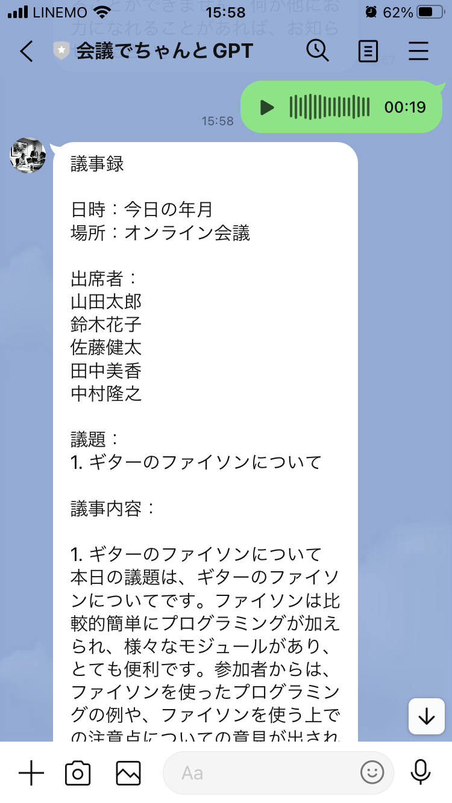

## **LINE アカウント 会議でちゃんとGPT**
* 現在試験中です．

### **機能**
* 主な利用用途は会議や取材、先生に質問時など様々な場面に使用できる
* 基本的な機能は以下の4つである．

```
1. 入力した文章を要約する機能
2. 録音したデータを文章に要約する機能
3. ビデオデータを文章に要約する機能
4. メモ紙の画像データから文章に要約する機能

```

### **試験中の様子**
* 単純な文章入力の例

<!-- fig1 -->
<p><div align = "center"></div></p>
<p><h3><div align="center">図1.1 単純な文章入力の例</h3></div></p>

* 録音データの例
<!-- fig2 -->
<p><div align = "center"></div></p>
<p><h3><div align="center">図1.2 録音データの例</h3></div></p>

### **方針**
* 運用を検討中
* 需要があれば，ちゃんとしたserverを借りたいと思います…